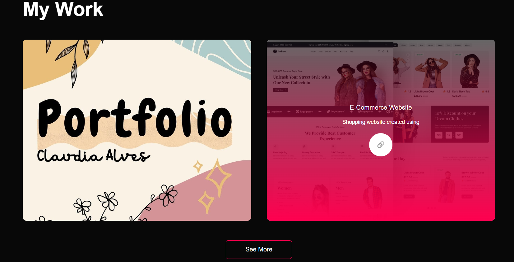

# Responsive-Portfolio
# Portfolio Website

This is my personal portfolio website. It showcases my projects, skills, and contact information. The website is built using HTML and CSS and is fully responsive.

## Features

- Responsive design
- Contact form with submissions stored in an Excel sheet
- Links to social media profiles
- Option to download my CV

## Screenshots

## Contact Form

The contact form submissions are stored in an Excel sheet using a backend script.

## Download CV

You can download my CV from the website.

